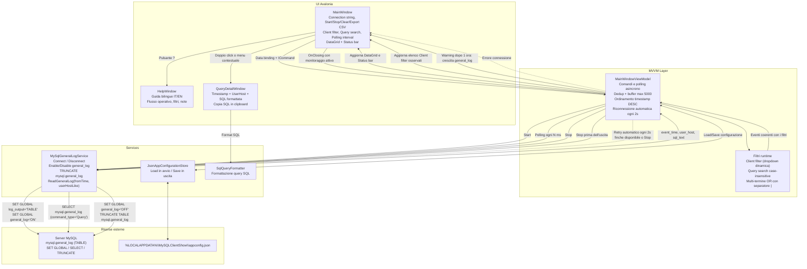

# MySQL Client Show

Desktop app Windows in **C#/.NET 8 + Avalonia** per monitorare in tempo reale le query MySQL lette da `mysql.general_log` (output su `TABLE`).


## Funzionalita
- Connessione a server MySQL tramite connection string.
  - Se la stringa viene incollata con virgolette esterne (`"..."` o `'...'`), vengono rimosse automaticamente.
- Avvio/arresto monitoraggio con gestione automatica di:
  - `SET GLOBAL log_output = 'TABLE';`
  - `SET GLOBAL general_log = 'ON'/'OFF';`
  - in `Stop`: `TRUNCATE TABLE mysql.general_log;`
- Polling configurabile (`Polling interval (ms)`) con vincoli:
  - Default: `1000`
  - Min: `200`
  - Max: `60000`
- Filtro client tramite dropdown (`user_host`) con popolamento dinamico dai dati di polling.
- Ricerca parziale nel testo SQL tramite campo `Query search` (case-insensitive) con supporto multi-termine separato da `|` (match OR).
- Con filtri attivi, i nuovi eventi non coerenti (`Client filter`/`Query search`) vengono scartati in ingresso e non entrano nel buffer in memoria.
- Il pulsante `Clear` svuota buffer e resetta l'elenco `Client filter` al solo valore `(Tutti i client)`.
- Buffer query a finestra scorrevole: massimo `5000` righe in memoria; quando si supera il limite vengono rimosse automaticamente le piu vecchie.
- Griglia risultati con timestamp, user host, SQL.
- Ordinamento di default griglia: `Timestamp` decrescente (record piu recenti in alto).
- Apertura dettaglio query SQL:
  - doppio click su una riga della griglia
  - menu contestuale su riga (`tasto destro` -> `Apri dettaglio query`)
- Copia rapida query:
  - menu contestuale su riga (`tasto destro` -> `Copia query in clipboard`)
- Finestra dettaglio query con:
  - SQL formattata per leggibilita
  - scrollbar verticale/orizzontale
  - azione `Copia SQL`
- Export CSV dei dati visibili in griglia, mantenendo filtro e ordinamento correnti.
- Pulsante `?` nella toolbar che apre una finestra Help con guida programma + filtri in Italiano e in English.
- Stato e conteggi in footer.
- Dopo 1 ora di monitoraggio continuo (`Start` attivo), nel footer compare un avviso: la tabella `mysql.general_log` sta crescendo.
- Titolo finestra con versione programma evidenziata (es. `MySQL Client Show - v2026.2.16.1308`).
- Finestra principale centrata automaticamente all'avvio (`CenterScreen`).
- Se la dimensione iniziale della finestra supera lo schermo corrente, la finestra viene massimizzata automaticamente all'avvio.
- Se la connessione MySQL cade durante il monitoraggio, il polling non si ferma: l'app tenta la riconnessione automatica ogni 2 secondi.
- Su macOS, la finestra applica esplicitamente l'icona da PNG per migliorare la visualizzazione nel runtime desktop.
- Su macOS, l'icona Dock viene impostata esplicitamente a runtime dal PNG applicativo (best effort) per evitare l'icona vuota.
- Su macOS, dopo la build viene generato automaticamente anche il bundle `MySQLClientShow.App.app` con `Info.plist` e icona `.icns` per evitare icona vuota in Finder.
- Su macOS, il menu applicazione nella barra dei menu usa il nome `MySQL Client Show` invece del fallback `Avalonia`.
- Su macOS, la voce di default `About Avalonia` e' rimossa; la chiusura resta disponibile in `File -> Quit MySQL Client Show`.
- Su macOS, il menu applicazione (prima voce, con nome app) viene impostato esplicitamente senza voci di default Avalonia.
- Su macOS, non viene aggiunto un secondo menu `MySQL Client Show` nella barra dei menu.
- Su macOS, nel menu `File` sono disponibili anche le azioni della toolbar: `Start`, `Stop`, `Clear`, `Export CSV` e `Help / Aiuto (?)`.
- Configurazione persistente in JSON caricata all'avvio e salvata in uscita.
- In chiusura app, se il polling e' attivo viene forzata la procedura di `Stop` prima dell'uscita.
- In build `Debug`, all'avvio vengono caricati automaticamente 5 record demo nella griglia.
- L'inizio polling si ancora a `CURRENT_TIMESTAMP(6)` del server MySQL per evitare mismatch di timezone client/server sui filtri temporali.

## Stack tecnico
- .NET 8
- Avalonia 11
- CommunityToolkit.Mvvm
- MySqlConnector

## Requisiti
- Windows (app configurata come `WinExe`).
- SDK .NET 8 installato.
- Accesso a un server MySQL/MariaDB con privilegi per:
  - `SET GLOBAL`
  - lettura `mysql.general_log`
  - `TRUNCATE TABLE mysql.general_log`

## Avvio rapido
```bash
dotnet restore
dotnet build MySQLClientShow.sln
dotnet run --project MySQLClientShow.App
```

Su macOS, dopo `dotnet build`, il bundle applicativo e' disponibile in:

`MySQLClientShow.App/bin/Debug/net8.0/MySQLClientShow.App.app`

## Utilizzo
1. Inserisci la connection string.
2. Imposta il polling (default `1000 ms`).
3. Premi `Start`.
4. Seleziona un client dalla dropdown `Client filter` (opzionale, lista aggiornata automaticamente quando arrivano nuovi client).
5. Usa `Query search` per filtrare in modo parziale il contenuto della colonna SQL (es. `select|orders|where id`).
6. Premi `?` per aprire l'help bilingue (Italiano/English) con spiegazione di flusso operativo e filtri.
7. Apri il dettaglio SQL di una riga con doppio click oppure con `tasto destro` -> `Apri dettaglio query`.
8. In alternativa copia al volo la query con `tasto destro` -> `Copia query in clipboard`.
9. Nella finestra dettaglio usa `Copia SQL` per copiare la query formattata.
10. Premi `Export CSV` per salvare i dati attualmente visibili in griglia (stesso filtro/sort).
11. Premi `Clear` per svuotare i dati e ripulire la lista `Client filter`.
12. Premi `Stop` per fermare il monitoraggio, disattivare `general_log` e svuotare `mysql.general_log`.
13. Se chiudi la finestra con monitoraggio attivo, l'app esegue prima lo stop polling e poi termina.
14. Su macOS puoi richiamare da menu `File` le stesse azioni dei pulsanti: `Start`, `Stop`, `Clear`, `Export CSV` e `Help / Aiuto (?)`.

## Diagramma finestre e funzioni


## Configurazione JSON
La configurazione utente viene persistita in:

`%LOCALAPPDATA%\MySQLClientShow\appconfig.json`

Campi salvati:
- `ConnectionString`
- `ClientFilter`
- `QuerySearchFilter`
- `PollingIntervalMs`

Esempio:
```json
{
  "ConnectionString": "Server=127.0.0.1;Port=3306;User ID=root;Password=***;Database=mysql;",
  "ClientFilter": "app_user@10.0.",
  "QuerySearchFilter": "orders",
  "PollingIntervalMs": 1000
}
```

## Query usata per la lettura log
```sql
SELECT
  event_time,
  user_host,
  CAST(argument AS CHAR(65535)) AS sql_text
FROM mysql.general_log
WHERE command_type = 'Query'
  AND argument IS NOT NULL
  AND user_host LIKE @userHostLike
  AND event_time >= @fromTime
ORDER BY event_time ASC;
```

## Note importanti
- `general_log` puo avere impatto sulle performance: usare con criterio, specialmente su ambienti di produzione.
- In `Stop`, la tabella `mysql.general_log` viene svuotata con `TRUNCATE TABLE mysql.general_log;`.
- Se il monitoraggio resta attivo oltre 1 ora, la barra di stato mostra un avviso di crescita di `mysql.general_log`.
- La connection string e salvata in chiaro nel file JSON locale: proteggi il profilo utente/machine.
- I record demo sono presenti solo in modalita `Debug` e vengono azzerati quando premi `Start` (reset buffer).
- In caso di errori di autenticazione/handshake, lo stato mostra suggerimenti (es. host autorizzato, `AllowPublicKeyRetrieval=True`, SSL).
- Se un evento viene scartato per filtro in fase di ingresso, non verra recuperato automaticamente cambiando filtro in seguito.
- La griglia e' scrollabile, ma il buffer resta limitato alle ultime `5000` query.
- In avvio, se la finestra richiesta e' piu grande dell'area visibile monitor, l'app passa automaticamente a finestra massimizzata.
- In caso di disconnessione MySQL durante il polling, la barra di stato mostra l'errore e l'app continua a tentare la riconnessione ogni 2 secondi finche non riesce o finche non premi `Stop`.

## Struttura progetto
```text
MySQLClientShow.sln
MySQLClientShow.App/
  App.axaml
  Program.cs
  Views/MainWindow.axaml
  Views/MainWindow.axaml.cs
  Views/HelpWindow.axaml
  Views/HelpWindow.axaml.cs
  Views/QueryDetailWindow.axaml
  Views/QueryDetailWindow.axaml.cs
  ViewModels/MainWindowViewModel.cs
  Services/MySqlGeneralLogService.cs
  Services/JsonAppConfigurationStore.cs
  Configuration/AppConfiguration.cs
  Utilities/SqlQueryFormatter.cs
  Assets/mysql-client-show.ico
  Assets/mysql-client-show.icns
  Assets/mysql-client-show.png
```
